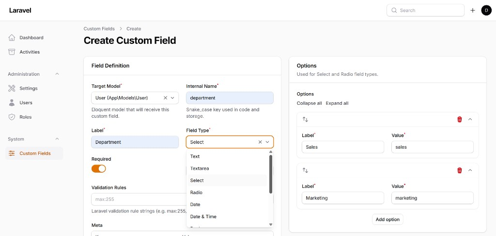

# Spiggle Dynamic Fields Core

[](LICENSE)
[](https://php.net)
[](https://laravel.com)
[](https://filamentphp.com)

**Custom fields for Laravel + Filament — no migrations per field, no redeploy.**

Create and manage fields from the admin panel. Values live in indexed EAV tables and appear on forms, table columns, and infolists automatically.



**[Watch the demo on YouTube →](https://youtu.be/t2MORdJdcBg)**

| | |
|---|---|
| **Package** | `spiggle/dynamic-fields-core` v2.1.2 |
| **License** | MIT (Community Edition) |
| **GitHub** | [skillbobby/Spiggle-Dynamic-Fields-Core](https://github.com/skillbobby/Spiggle-Dynamic-Fields-Core) |
| **Docs** | [Product site & guide](https://skillbobby.github.io/Spiggle-Dynamic-Fields-Core/) |

---

## Why use Dynamic Fields?

- **No-code field creation** — define labels, types, validation, and options in the Filament panel
- **No migration per field** — add fields without schema changes or redeploys
- **Filament-native** — maps to standard Filament form inputs, table columns, and infolist entries
- **EAV storage** — indexed `custom_fields`, `custom_field_options`, and `custom_field_values` tables (not a bloated JSON column)
- **Built-in validation** — Laravel rules (`required`, `email`, `min`/`max`, `regex`, etc.) configured in the UI
- **Table columns included** — toggleable, searchable columns for every saved field
- **Model-agnostic** — attach fields to Users, Products, or any Eloquent model
- **Export / import** — move field definitions between environments as JSON
- **Pro-ready** — registry hooks let the licensed add-on register advanced field drivers

---

## Community Edition field types

These **12 types** are included free in Core:

| | | |
|---|---|---|
| `text` | `email` | `phone` |
| `url` | `number` | `textarea` |
| `select` | `radio` | `date` |
| `datetime` | `boolean` | `toggle` |

---

## Pro field types & features

Need file uploads, rich text, tags, or conditional logic? Upgrade to **Dynamic Fields Pro** — a separate licensed add-on that installs alongside Core.

| Pro-only | |
|---|---|
| **File uploads** | Spatie Media Library collections |
| **Tags** | Colored badge tags |
| **Multi-select** | Searchable multi-choice fields |
| **Rich textarea** | WYSIWYG editor (RichEditor) |
| **Conditional visibility** | Show/hide fields with `visible_when` rules |
| **Clone** | Duplicate field definitions in one click |
| **License management** | Activate and manage your Pro license in Filament |

**[Get Pro license](https://kodesmart.lemonsqueezy.com/checkout/buy/da102aee-e7fa-41b1-8f8d-bf552776edb1?enabled=2037699)**

Business / unlimited-site licensing: **[Get Business license](https://kodesmart.lemonsqueezy.com/checkout/buy/4ad8647d-2bfc-4aca-a2f1-923236b32cd4?enabled=2037700)**.

---

## Requirements

- PHP **8.3+**
- Laravel **13**
- Filament **^5**

---

## Installation

### 1. Require the package

```bash
composer require spiggle/dynamic-fields-core
```

### 2. Publish config & migrations, then migrate

```bash
php artisan vendor:publish --tag=dynamic-fields-config
php artisan vendor:publish --tag=dynamic-fields-migrations
php artisan migrate
```

### 3. Register the Filament plugin

In your panel provider (e.g. `app/Providers/Filament/AdminPanelProvider.php`):

```php
use Spiggle\DynamicFields\Filament\DynamicFieldsPlugin;

$panel->plugin(DynamicFieldsPlugin::make());
```

This adds the **Custom Fields** resource under **System** in your panel navigation.

### 4. Add `HasCustomFields` to your model

```php
use Spiggle\DynamicFields\Traits\HasCustomFields;

class User extends Authenticatable
{
    use HasCustomFields;
}
```

Include `custom_fields` in your model's `$fillable` (or use `syncCustomFields()` in a page hook) so Filament can persist nested field state.

### 5. Wire `CustomFieldMapper` in your Filament resource

**Form:**

```php
use Filament\Schemas\Components\Section;
use Spiggle\DynamicFields\Facades\CustomFieldMapper;

Section::make('Custom Profile Data')
    ->schema(CustomFieldMapper::makeFormFields(User::class));
```

**Table** (eager-load to avoid N+1):

```php
User::query()->withCustomFields()
// ...
...CustomFieldMapper::makeTableColumns(User::class)
```

**Infolist:**

```php
CustomFieldMapper::makeInfolistEntries(User::class)
```

---

## Quick start

1. Sign in to your Filament panel.
2. Go to **System → Custom Fields**.
3. Click **New Custom Field**, choose a target model, set label + type, add validation rules.
4. Save — the field appears on that model's resource form and is available as a table column.

Seed 23 standard User profile fields:

```bash
php artisan dynamic-fields:seed-user-fields
```

---

## Artisan commands

| Command | Description |
|---|---|
| `dynamic-fields:seed-user-fields` | Seed standard User profile fields |
| `dynamic-fields:export` | Export definitions to JSON |
| `dynamic-fields:import {path}` | Import definitions from JSON |
| `dynamic-fields:verify` | Health-check tables, mapper, and persistence |

---

## Related

- **[Full documentation](https://skillbobby.github.io/Spiggle-Dynamic-Fields-Core/guide/)** — architecture, workflows, configuration
- **[Live demo](https://skillbobby.com/larafill/public/admin/login)** — `demo@user.net` / `password`
- **[Spiggle Form Builder](https://skillbobby.github.io/Spiggle-Plugins/form-builder/)** — public forms that reuse the same field types

---

## Security

Please report vulnerabilities privately — see [SECURITY.md](SECURITY.md). Do not open a public issue for security problems.

## License

MIT — see [LICENSE](LICENSE). Community Edition is free and open source. Pro is a separate commercial add-on.
